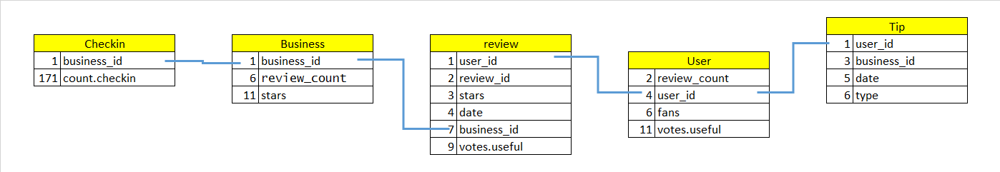
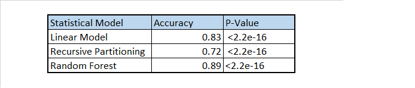

Capstone Project Coursera Data Science
========================================================

author: PCM

date: 08-11-2015

Primary question of intrest
========================================================
<small><small>
- Is it possible to predict the average of stars a business will obtain by taking into account previous values ? 

- Would this change if I consider only influential users or reviews ? 

- This is interesting for businesses because a high correlation of evaluations would imply consistency in the aggregation of user activity across time. 

- Hence, if a particular business experiences big increases or decreases, Yelp can help by highlighting problems to address or opportunities to explore.
</small></small>

Methodology used
========================================================
<small><small>- I had to join the tables by commnon fileds (see blue lines)

- Then I created a new table to reply the question
 
- I removed the variables that were creating confusion 
- I pre-run some models by checking prediction accuracy (first witouth considering influencer)
- I decide to reduce to only influential reviews because of the disapointing results
***
 
- The algorithm to predict was average stars based on -> previous and current minimum, maximun values, check ins and counts 
- I trained the data by using 70% of the records as training set and the rest as test
- I used 3 different methods to obtaine the reulsts (accuracy). See table:

- In the conclusion I show the confusion matrix when using random forest.

</small></small>

Results - Prediction accuray of model 
========================================================
<small><small>

The following plot/table shows the Confusion Maxtrix obtained after applying the random forest model to the influential reviews
And we can see an accuracy of prediction of 89%

***

The model predicts the reviews in 5 classes. And each of them represents the number of stars in the reviews.

From this matrix we can see that our classifier correctly identified (sensitivity or true positive) the number of stars by 100%, 83%, 78%, 96% and 81% of the times respectively. 

On the other hand, when we shouldn't have predicted a number of stars we didn't (specificity or true negative) by 100%, 100%, 96%, 84% and 100% respectively. Therefore for all the classes, the model did a good estimation.
</small></small>

Concusion - Answer to the primary question
====================================
<small><small><small>

The results indicate that the previous averag of starts, maximun and minimun and number given by influential users is closely related to the average of stars for the year under investigation.

The primary question of interest was answered by the model. So we can conclude that I can predict with almost 90% of accuracy.

This implies, in my opinion that the influential reviews are strongly related to other reviews. The user that is influenced by this review qualified the review as useful or is a fan of the reviewer because he has a high level of agreement in taste and opinions. 
</small></small></small>

***

<small><small><small>
If the qualification of useful review was given by the next user after he purchased or visit the business, there is a strong possibility that he/she agreed with the first reviewer. The fans, as per my theory will also have a strong tendency to agree and hence have the same number of stars.

The business would do well to know who are the influential reviewers. They could target them in special promotions to encourage them to visit their business if they did not do it and influence his followers. In case they did visit, they could obtain an updated and better review.
</small></small></small>
